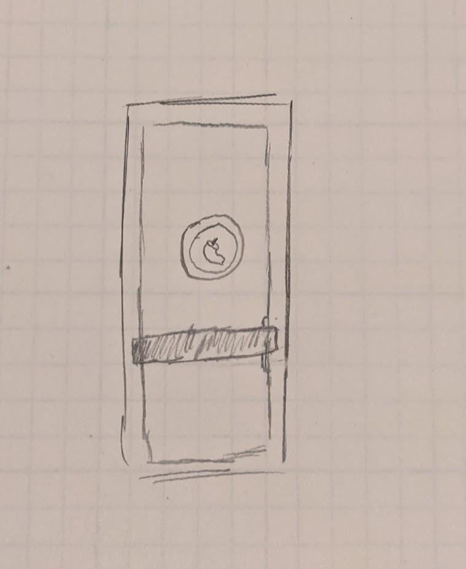
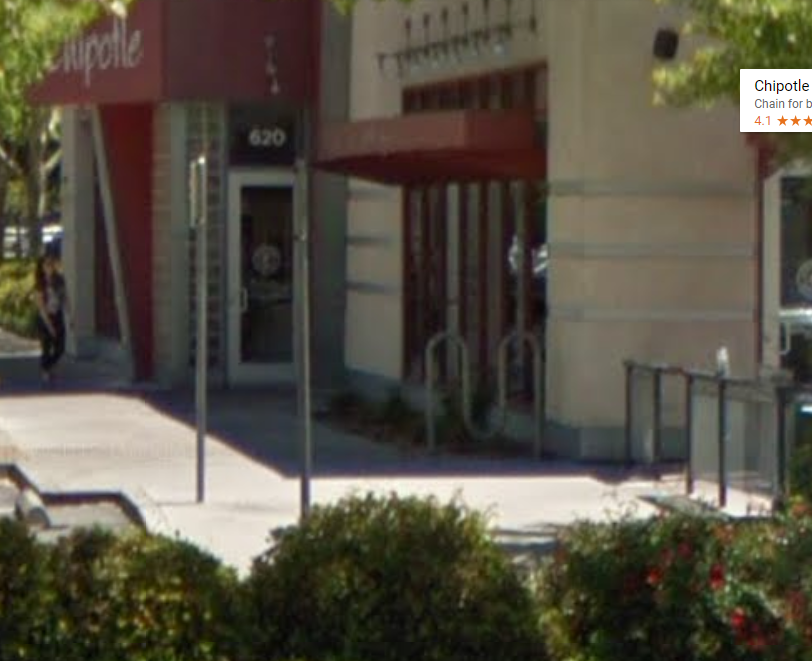

Carlson Smith  
03/06/2021 
CSCI431W 

# Confusing Exits

&nbsp;&nbsp;&nbsp;&nbsp;&nbsp;It’s 6:30 pm and I just got my burrito from Chipotle.  Ready to hop in my car I head to the exit while talking to my friend who tagged along.  Though when I get to the exit, the door won’t open, I push a little harder but still nothing until I finally put my whole hip into the door to add some extra oomph.  The mistake I made was pushing the door on the left side instead of the right.  The door looked very similar to the one below, a glass door with a silver aluminum border and a black bar across the middle around the torso level.  While the affordance (The properties of the object saying what actions the user can take) says to push the door indicated by the black bar, there is no indication of which side to push on.  While you can see a slight sliver of a handle on the right side, there is nothing else to indicate the orientation of the door leading to the issue I ended up having at that moment. 
 
 
 
&nbsp;&nbsp;&nbsp;&nbsp;&nbsp;The door in question can be found at the corner of Mangrove Ave. and Vallembrosa Ave. in Chico CA and I have a few gripes that could make the door just a little easier to use.  Entering Chipotle is no issue as you can see in the image below, the affordance tells you exactly what to do with a handle on the left indicating to pull.  This is probably the most efficient and simple way of indicating the orientation of the door. 
 
 
 
&nbsp;&nbsp;&nbsp;&nbsp;&nbsp;This entrance is learnable, useful, effective, and ticks most of the other useability goals of a door.  The exit side of the door could be fixed to also make it fit the same properties but most importantly be very learnable.  My idea to fix this is to simply make the black push bar only have the push lever on the right side when walking towards it.  By placing the push section of the bar on the right, the understanding of the door and its inner working would be much more apparent.  You would instantly know which side to push as well as where the door would swing.  Anyone could walk up and interact with the door easily whether they’re paying attention or not.  If you’re paying attention to the current design you might see the small indication of a handle on the other side, but it’s not quite enough to tell the whole story to a user trying to exit the building.

