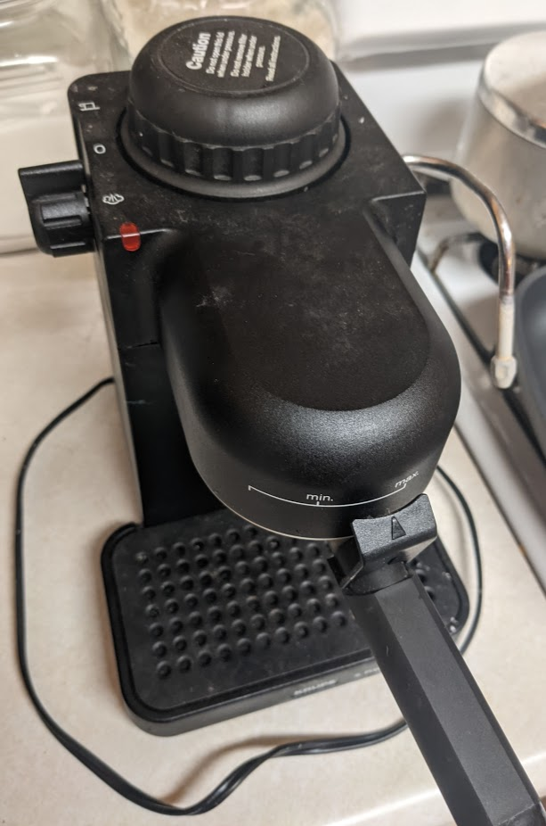
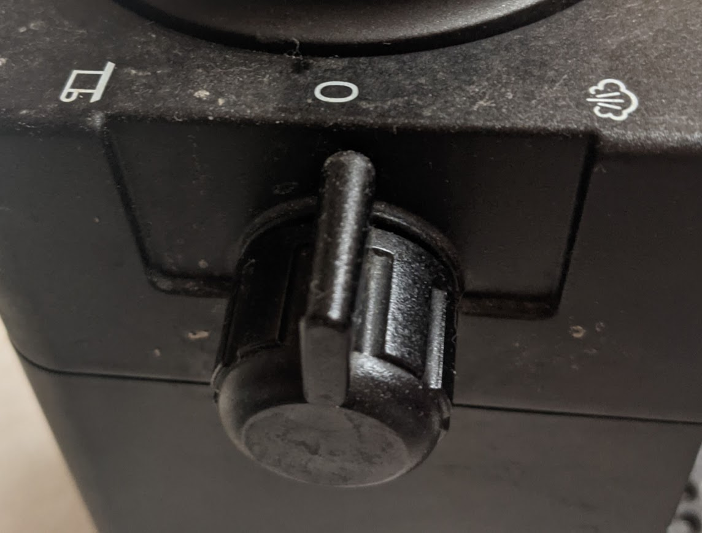

Carlson Smith  
05/02/2021 
CSCI301W 

# Morning Coffee

  It’s the morning and time for another cup of coffee to get the day started.  As I go digging around to find my Moms’ old espresso machine I end up finding myself with the question of “how do I use this thing?”.  For someone who’s experienced in making espresso it might be trivial, but for someone who is used to a Keurig coffee maker, this machine is very foreign.  I can guess where coffee beans might go, and figure out where the water is placed with the nice message on top of the dome-looking lid, but that’s really all you initially get. 
 
  As one looks closer by rotating the handle pointing toward you, the place to put coffee beans is found.  Looking again, you might make out the **`Affordance`** setting on the dial with the little images that look like a cup of coffee and steam.  The only issue is you don’t know how to turn on this device or what steam and coffee cup settings do.  With a little fiddling, you figure out that turning the dial gets things moving with a light and sound starting the water heating process up. 
 
  After turning the dial to the coffee cup and waiting, you get espresso coming out of the little cup you put in earlier and you’re ready to start your day and head off to start zoom class.  One issue is presented in this process, the compressed hot water is still sitting there waiting to be released.  The Safety of this is not the best from my experience as one releases the sealed lid on top and promptly gets burnt by piping hot steam.  The only way to avoid this is to turn the dial towards the steam side which is normally meant to steam the milk for your coffee. 
  To fix this design up I think the espresso machine should be changed a little bit with 0 being replaced with OFF, and possibly adding a pressure release button to avoid hurting yourself when taking the cap off.  By adding OFF, you would make the machine more Learnable since you would know where to look when trying to turn the device on in the first place.  Next, the pressure release button would add make things a lot Safer as you would avoid getting burnt by steam.  At the end of the day though, the Satisfaction of a nice cup of espresso is hard to beat.  

